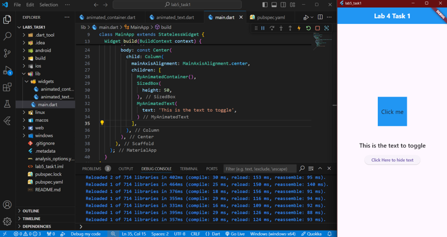
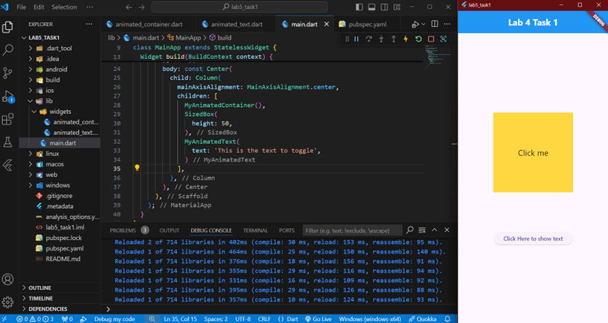

# Flutter Animated Widgets Example

As assigned in Task 1 of Lab 5, this Flutter project demonstrates the use of animated widgets, specifically an animated container and an animated text widget. The goal is to showcase how to create engaging UI elements using animations in Flutter.

## Features

- **Animated Container**: A container that changes its size and color when tapped.
- **Animated Text**: A text that fades in and out on button presses.

## Installation

To get started with this project, follow these steps:

1. **Clone the repository**:
   ```bash
   git clone https://github.com/jtareen/lab5_task1.git
   ```

2. **Navigate to the project directory**:
   ```bash
   cd repo-name
   ```

3. **Install the dependencies**:
   ```bash
   flutter pub get
   ```

4. **Run the app**:
   ```bash
   flutter run
   ```

## Usage

- Tap on the **Animated Container** to see it expand and change color.
- Click the button below the **Animated Text** to toggle its visibility.

## Screenshots

Here are some screenshots of the application:





## License

This project is licensed under the MIT License - see the [LICENSE](LICENSE) file for details.

## Acknowledgments

- Thanks to the Flutter community for providing great resources and documentation.